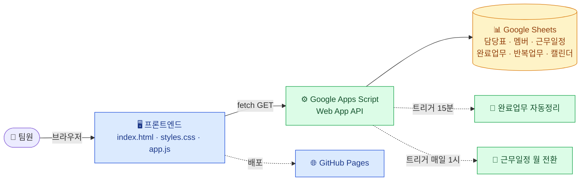
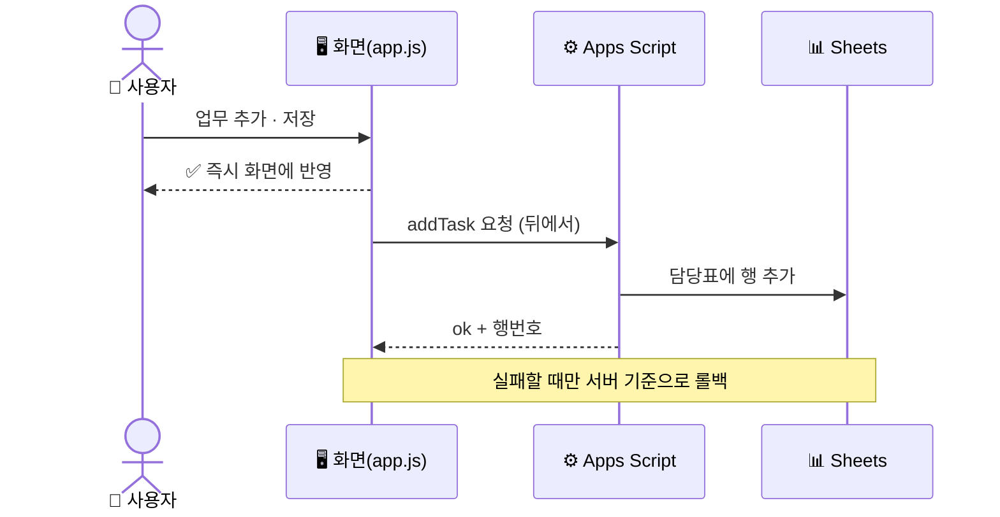
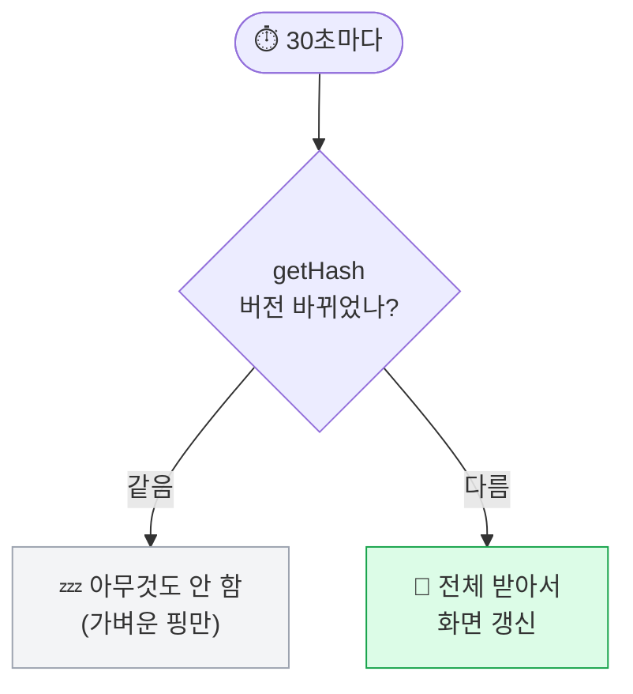
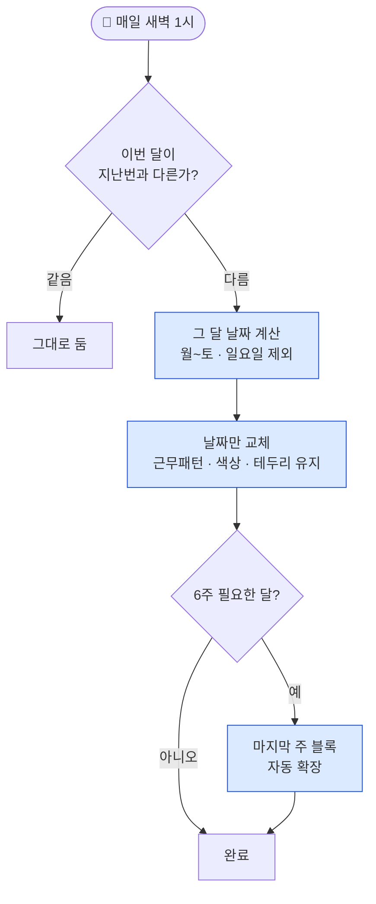
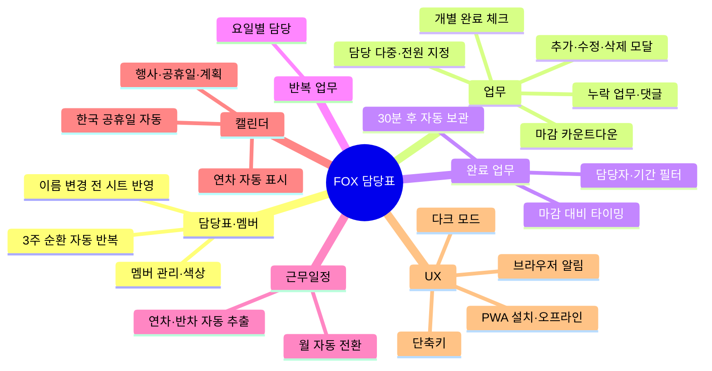

<div align="center">


</div>

---

3인 팀(팀장 1 · 연구원 2)의 **3주 순환 근무 담당표 + 업무 관리 + 근무 일정 + 연간 캘린더**를 한 화면에 모은 웹 대시보드입니다.
Google Sheets를 DB로, Google Apps Script를 백엔드로, GitHub Pages를 호스팅으로 쓰는 **서버리스 구조**라 운영비가 0원입니다.

---

## 🗺️ 전체 구조



> 프론트는 **프레임워크 없이 순수 JS**. 백엔드는 **GAS Web App**. 데이터는 **내 구글 시트**에 그대로 남습니다.

---

## ⚡ 핵심 동작 흐름

### 업무 추가 — 즉시 반응(낙관적 UI)



### 30초 자동 갱신 — 변경된 것만 다시 그림



### 근무일정 월 자동 전환 — 날짜만 바뀌고 패턴은 유지



---

## ✨ 기능 한눈에 보기



<details>
<summary><b>📋 기능 상세 (펼치기)</b></summary>

**담당표 · 멤버**
- 3주 순환 담당표(앵커 기준 무한 반복, 오늘 강조)
- 멤버 추가/수정/삭제 · 8색 슬롯 · 이름 변경 시 모든 시트 자동 반영

**업무 관리**
- 모달에서 추가/수정/삭제 · 담당 다중 선택("AI 연구원 전원" 포함)
- 개별 완료 체크(전원 완료 시 자동 완료) · 마감 카운트다운 배지
- 누락 업무 모아보기 · 업무별 댓글(작성자 필수, 익명 불가)

**완료 업무**
- 완료 30분 뒤 '완료 업무' 시트로 자동 아카이브
- 담당자/기간 필터 · 마감 대비 빠름·당일·지각 배지 · 수동 추가

**반복 업무**
- 요일별 담당(월~토 각 칸에 사람 또는 활동 키워드) · 오늘 요일 강조

**근무 일정**
- 매달 1일 기준 그 달로 날짜 자동 교체(패턴·서식 유지)
- 연차·반차 자동 추출(7일 이내 강조)

**연간 캘린더(2026~2027)**
- 행사/공휴일/계획 색상 구분 · 기간 일정 연속 막대
- 한국 공휴일 자동(설날·추석·대체공휴일) · 근무일정 연차 자동 표시

**UX · 성능**
- 30초 해시 폴링 · 낙관적 UI · 브라우저 알림 · 다크 모드 · PWA · 단축키(N/Esc)

</details>

---

## 🆚 기존 방식과 뭐가 다른가

| | 구글 시트만 | 노션·트렐로 | **이 대시보드** |
|---|:---:|:---:|:---:|
| 모바일 보기 | 🟥 불편 | 🟨 보통 | 🟩 PWA·반응형 |
| 3주 순환·근무일정 | 🟨 수동 | 🟥 직접 구성 | 🟩 내장 |
| 마감 알림·카운트다운 | 🟥 없음 | 🟨 일부 | 🟩 배지+알림 |
| 연차 ↔ 캘린더 | 🟥 수동 | 🟥 수동 | 🟩 자동 |
| 월 날짜 갱신 | 🟥 매번 손으로 | — | 🟩 매달 자동 |
| 비용 | 🟩 무료 | 🟨 제한/유료 | 🟩 무료 |
| 데이터 소유권 | 🟩 내 시트 | 🟥 외부 | 🟩 **내 시트 그대로** |

➡️ **구글 시트의 데이터 소유권은 그대로 두고**, 시트로는 불편한 모바일 UX·알림·필터·자동화를 얹은 형태입니다.

---

## 💻 다른 컴퓨터에서 작업하기

> 이 프로젝트는 GitHub에 올려두고 **여러 컴퓨터에서 작업**할 수 있게 되어 있습니다.
> 아래는 새 컴퓨터에서 처음 한 번만 하면 되는 설정이에요. (예전에 메모로 저장해둔 내용이 바로 이것)

**① 처음 1회 설정**
```bash
gh auth login                                                         # GitHub 로그인(브라우저 인증)
git clone https://github.com/sungJJoo/fox-ai-research-schedule.git    # 저장소 내려받기
cd fox-ai-research-schedule                                           # 폴더로 이동
git config --global user.name  "이름"
git config --global user.email "이메일"
```

**② 작업할 때마다**
```bash
git pull                     # 다른 PC에서 한 변경 먼저 받기 (충돌 방지)
# ...파일 수정...
git add .
git commit -m "변경 내용"
git push                     # 1~2분 뒤 사이트에 자동 반영
```

---

## 🔧 백엔드(GAS) 변경 시

1. `apps-script.gs` 수정
2. [Raw 파일](https://raw.githubusercontent.com/sungJJoo/fox-ai-research-schedule/main/apps-script.gs) 전체 복사 → GAS 편집기에 덮어쓰기 → 저장
3. **배포 → 배포 관리 → ✏️ → 버전 "새 버전" → 배포**
4. URL이 바뀌면 `app.js`의 `API_URL` 갱신 후 commit/push

**트리거 (GAS 편집기에서 1회 실행)**
- `installTrigger` — 완료 업무 자동 정리(15분마다)
- `installMonthTrigger` — 근무일정 월 자동 전환(매일 새벽 1시 점검)

---

## 📁 파일 구성

| 파일 | 역할 |
|---|---|
| `index.html` | HTML 마크업 (PWA 메타 포함) |
| `styles.css` | 전체 스타일 (다크 모드 포함) |
| `app.js` | 클라이언트 로직 전체 |
| `apps-script.gs` | GAS 백엔드 코드 백업 |
| `manifest.json` · `sw.js` · `icon.svg` | PWA (설치·오프라인) |

<div align="center">

🤖 Built with [Claude Code](https://claude.com/claude-code)

</div>
